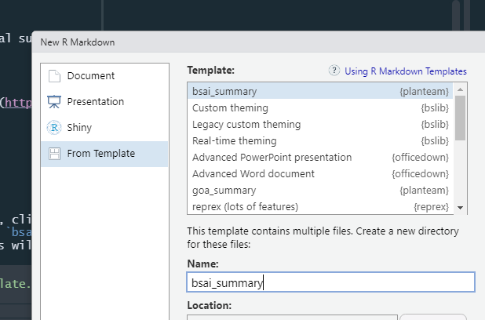

<!-- README.md is generated from README.Rmd. Please edit that file -->

# planteam

<!-- badges: start -->
<!-- badges: end -->

The goal of planteam is to facilitate the development of the annual
summary using .Rmd files to produce a word doc - that will likely be
hosted on google docs for edits.

## Installation

You can install the development version of planteam from
[GitHub](https://github.com/) with:

``` r
# install.packages("devtools")
devtools::install_github("afsc-assessments/planteam")
```

## Example

Once `planteam` is installed on your machine open a new .Rmd file, click
on the “From Template” find the one that is called `goa_summary`, or
`bsai_summary` name it **goa_summary** or **bsai_summary** - *example
links won’t work otherwise* - and the suite of .Rmd files will be placed
in the folder.


